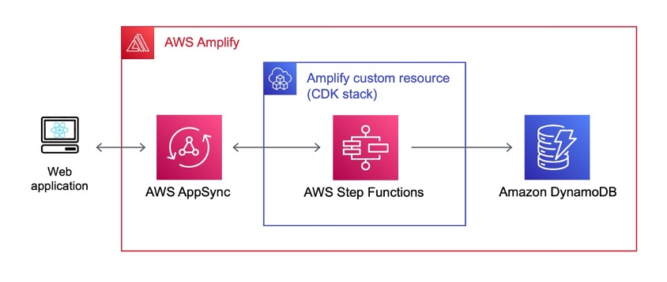
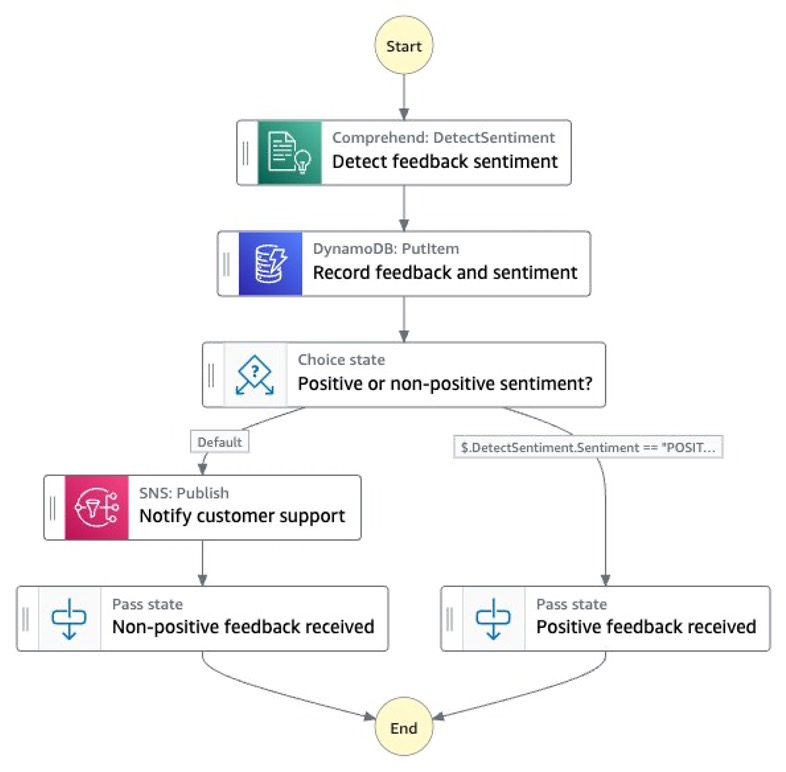
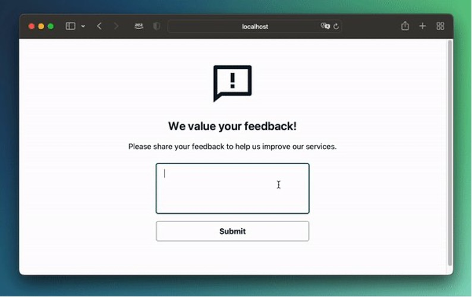

## aws-amplify-stepfunctions-example

In this sample, we’ll use an [Amplify custom resource](https://docs.amplify.aws/cli/custom/cdk/) to add an [AWS Step Functions](https://aws.amazon.com/step-functions/) workflow to our Amplify project.

### What you will learn:
- How to create a Step Functions workflow as an Amplify custom resource using the AWS CDK.
- How to connect our custom resource to an existing Amplify-managed GraphQL API.

### What you will build

  

The proposed solution consists of the following elements:
- Our sample web application is a customer feedback form built using [Vite](https://vitejs.dev/) and [Amplify UI](https://ui.docs.amplify.aws/).
- Submitting the feedback form will trigger a Step Functions [express workflow](https://docs.aws.amazon.com/step-functions/latest/dg/concepts-standard-vs-express.html) created as an Amplify custom resource via an [AWS AppSync](https://aws.amazon.com/appsync/) API managed by Amplify.
- The Step Function workflow will detect the sentiment of the submitted feedback using [Amazon Comprehend](https://aws.amazon.com/comprehend/)’s `DetectSentiment` API.
- Next, the workflow will store the feedback and detected sentiment in an Amplify-managed [Amazon DynamoDB](https://aws.amazon.com/dynamodb/) table.
- If a non-positive sentiment is detected, the workflow will trigger a notification to a customer support email address using the [Amazon Simple Notification Service (Amazon SNS)](https://aws.amazon.com/sns/).
- Depending on the result of the sentiment analysis, our web application will display different confirmation messages to the customer.

The Step Functions workflow looks like this:

  

From the perspective of the user of our web application, the result will look like this:

  

For a walkthrough of the implementation, check out the [blog post](https://aws.amazon.com/blogs/mobile/integrate-aws-step-functions-with-aws-amplify-using-amplify-custom-resources/).

## Security

See [CONTRIBUTING](CONTRIBUTING.md#security-issue-notifications) for more information.

## License

This library is licensed under the MIT-0 License. See the LICENSE file.

